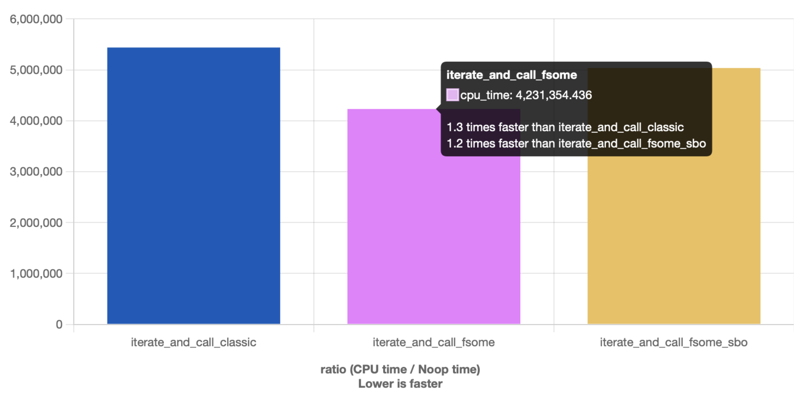
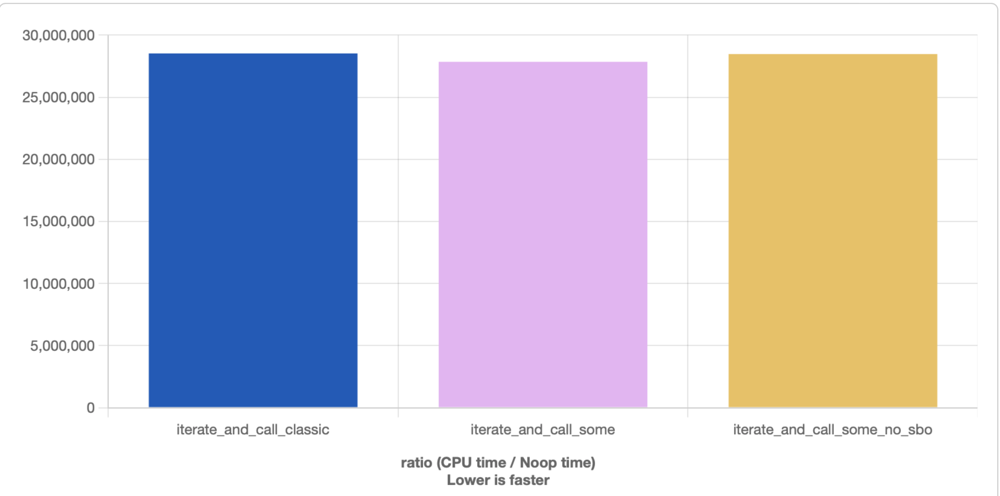
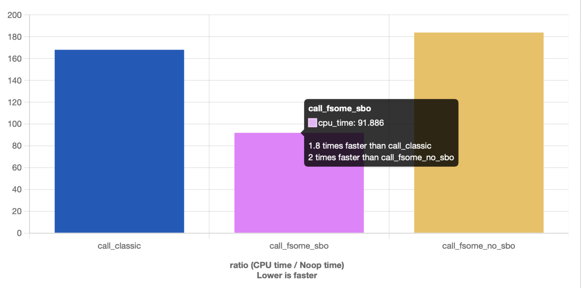
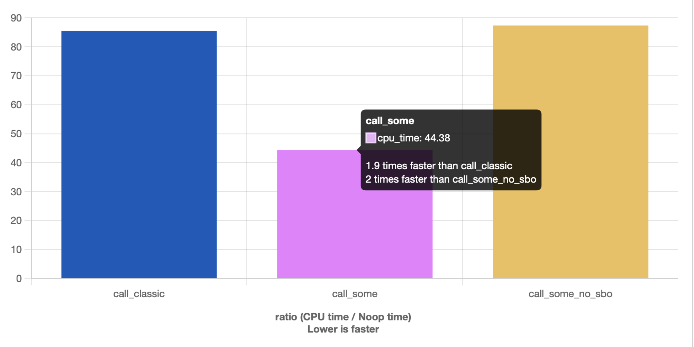

# `Some` is a runtime polymorphism library for modern `C++`, supporting `C++20` and onwards.

### What is it and what problems does it solve? 
This is a single-header, zero extrnal dependencies, and pretty easy-to-use type-erasing runtime polymorphism library. Just drop the `some.hpp` header in your project and you're all set!

        create polymorphic objects with value semantics and RAII memory ownership on the fly.

If "type-erasing runtime polymorphism" sounds scary, let's just say it's similar to the [Rust's Traits](https://doc.rust-lang.org/book/ch18-02-trait-objects.html) or [Go's interfaces](https://gobyexample.com/interfaces), so in a way it's C++ traits implementation.
In that it's somewhat similar to [Dyno](https://github.com/ldionne/dyno/), [Folly::Poly](https://github.com/facebook/folly/blob/0d868697d003578e42a8b5c445747b7a0bda4a49/folly/docs/Poly.md) or [AnyAny](https://github.com/kelbon/AnyAny/). However `some` was built with different trade-offs in mind and trying to steamline the user experience as much as possible without introducing any DSL-like descriptions and/or macros.

### What's included? 
- `some<[Trait], [config]>`
- `some<Trait&>` // non-owning polymorphic view using poly_view<Trait>
- `some<Trait const&>` // const non-owning polymorphic view using poly_view<Trait>
- `fsome<[Trait], [config]>` // fat-pointer version of some<>, optimised for speed
<details>
<summary>+ extras</summary>
    
- `poly_view<[const] Trait>`
- `some_ptr<[const] Trait>` (used in fsome<>)
    
</details>


### Getting started

Here is a very simple example of how you can use some<> even without Traits (about them in a second)
```C++
// without a trait, some can be used as std::any, but with a bunch of extra tricks up its sleeve (configurable SBO, configurable copy and move, ...)
vx::some<> anything = 1;
assert(( vx::some_cast<int>(anything) == 1 ));
vx::some_cast<int&>(anything) = 7;
assert(( vx::some_cast<int>(anything) == 7 ));
anything = std::string{"hi"};
std::cout << vx::some_cast<std::string const&>(anything);

// and same for `fsome`
vx::fsome<> anything = 1;
assert(( vx::some_cast<int>(anything) == 1 ));
vx::some_cast<int&>(anything) = 7;
assert(( vx::some_cast<int>(anything) == 7 ));
anything = std::string{"hi"};
std::cout << vx::some_cast<std::string const&>(anything);
```
But indeed the main raison d'etre of `some` is runtime polymorphism, so let us dive right into it!
Here is another simple example:
Let's say we have a simple struct `Square` that has a method `void draw(std::ostream&)`:
```C++
struct Square { // notice there is no inheritance
    //... may have some members
    void draw(std::ostream& out) const { out << "[ ]\n"; } // a plain non-virtual function
};
```
And for now let's just say that we already have a trait `Shape` that defines a method  `void draw(std::ostream&)`
Type-erasing the Square is as easy as this:
```C++
vx::some<Shape> obj = Square{};
obj->draw(std::cout);
```

Yes, it's that easy. Note, however, when accessing the polymorphic methods we should use the arrow `->` syntax. 
Now, let's see how to define such a trait:
```C++
struct Shape : vx::trait {
    virtual void draw(std::ostream&) const = 0;
};

/// describe the implementation
template <typename T>
//                +---- your trait's name
//              __|__             ,_______,-- this thing handles most of the complexities so that it works with some, fsome, and views
struct vx::impl<Shape, T> final : impl_for<Shape, T> {
    using impl_for<Shape, T>::impl_for; // <--- it's advisable to pull in the T's ctors like so, the impl_for<...> already wraps them

    /// Now just write it as you would if Square was derived from some IShape that had a virtual function draw to override
    void draw(std::ostream& out) const override { 
        vx::poly {this}->draw(out);
//      -------- ------ - poly {this} is a helper that gets the actual type of T from the impl<> 
    }
};
```
or, if you really don't like the `vx::poly {this}`
```C++
template <typename T>
//                +---- your trait's name
//              __|__             ,_______,-- this class handles most of the complexities so that it works with some, fsome, and views
struct vx::impl<Shape, T> final : impl_for<Shape, T> {
    using impl_for<Shape, T>::impl_for; // <--- it's advisable to pull in the T's ctors like so, the impl_for<...> already wraps them
    using impl_for<Shape, T>::self;

    /// Now just write it as you would if Square was derived from some IShape that had a virtual function draw to override
    void draw(std::ostream& out) const override { 
        self().draw(out);
//      ------ - same as (*poly {this})
    }
};
```

Not too bad, is it? There still is some boilerplate, but it is only written once per trait and as a result you have all the benefits for free for any objects that happen to satisfy this interface.

Meanwhile your original objects can still have a nice layout, no vptr embedded in them, they can stay trivially_copyable and so on.

Now, to a more realistic example:
Let's store some shapes in a std::vector and see how they compare with the standard approach.

<details>
    
<summary>
    
classic implementation

</summary>
    
```C++

struct IShape {
    virtual ~IShape() = default;
    virtual void draw(std::ostream&) const = 0;
    virtual void bump() noexcept = 0;
};

struct VSquare : public IShape {
    int side_ = 0;
    void draw(std::ostream& out) const override { out << "[ ]\n"; }
    void bump() noexcept override { side_ += 1; }
};

struct VCircle : public IShape {
    int radius_ = 0;
    void draw(std::ostream& out) const override { out << "( )\n"; }
    void bump() noexcept override { radius_ += 1; }
};
```

</details>

<details>
    
<summary>
    
A polymorphic approach

</summary>

```C++
struct Square { // no inheritance
    int side_ = 0;
    // plain functions
    void draw(std::ostream& out) const { out << "[ ]\n"; }
    void bump() noexcept { side_ += 1; }
};

struct Circle {
    int radius_ = 0;
    void draw(std::ostream& out) const { out << "( )\n"; }
    void bump() noexcept { radius_ += 1; }
};

/// We can define a new Trait anywhere, anytime
struct Shape : vx::trait {
    virtual void draw(std::ostream&) const = 0;
    virtual void bump() noexcept = 0;
};

/// trait implementation, the only boilerplate you'll have to write (once per trait)
template <typename T>
struct vx::impl<Shape, T> final : impl_for<Shape, T> {
    using impl_for<Shape, T>::impl_for; // pull in the ctors

    void draw(std::ostream& out) const override { 
        vx::poly {this}->draw(out); 
    }

    void bump() noexcept override {
        vx::poly {this}->bump(); 
    }
};

```
</details>

Let's define some functions that will iterate through the polymorphic elements in a vector 
```C++
///                                                                _____ NOTE: const here doesn't stop us from invoking bump() 
auto iterate_and_call_classic(std::vector<std::unique_ptr<IShape>> const& shapes) { // courtesy of pointer semantics, the pointer is const, whatever it points to - not so much
    std::size_t sides = 0;
    for (auto && p_shape : shapes) {
        p_shape->draw(std::cout);
        p_shape->bump();
    }
    return sides;
}

///                                                     _ a const here will trigger a compile-time error
auto iterate_and_call_some(std::vector<vx::some<Shape>> & shapes) {
    std::size_t sides = 0;
    for (auto && shape : shapes) {
        sides += shape->sides();
        shape->bump();
    }
    return sides;
}

///                                           +-- the same Trait lets you choose the polymorphic object's representation, `some` or `fsome` with different configurations 
///                                         __|__                       ____________ here, the nullability is disabled since we know that we won't need it for a given example
auto iterate_and_call_fsome(std::vector<vx::fsome<Shape, vx::cfg::fsome{.empty_state=false}>> & shapes) {
    std::size_t sides = 0;
    for (auto & shape : shapes) {
        sides += shape->sides(); // calling a method through `some` and `fsome` looks the same as calling it through a pointer
        shape->bump();
    }
    return sides;
}
```

Notice how `some` and `fsome` preserve the constness. Both support value semantics, so that when you copy or move one, you copy the polymorphic object, not the pointer to it, and without slicing ever happening!

and let's randomly populate these containers:
```C++

    static constexpr std::size_t N = 42;
    std::vector<std::unique_ptr<IShape>> classic_shapes {};
    classic_shapes.reserve(N);

    std::vector<vx::some<Shape>> some_shapes {};
    some_shapes.reserve(N);

    std::vector<vx::fsome<Shape, vx::cfg::fsome{.empty_state=false}>> fsome_shapes {};
    fsome_shapes.reserve(N);

    std::vector<vx::fsome<Shape, vx::cfg::fsome{.copy=false, .empty_state=false}>> fsome_of_everything {};

    std::random_device rd;
    std::mt19937 mt(rd());
    for (std::size_t i = 0; i < N; ++i) {
        if (mt() % 2 == 0) {
            classic_shapes.push_back(std::make_unique<VCircle>()); // TRICKY: new VCircle() may leak on vector reallocation
            some_shapes.emplace_back(Circle{});
            fsome_shapes.emplace_back(Circle{});
            fsome_nonsense.emplace_back(VCircle()); // we can even push a VCircle from the classic approach into some of fsome
        } else {
            classic_shapes.push_back(std::make_unique<VSquare>());
            some_shapes.emplace_back(Square{});
            fsome_shapes.emplace_back(Square{});
            fsome_nonsense.emplace_back(VSquare());
        }
    }
```

### Layout
Here's an approximate layout of `some` and `fsome`. 
#### some<> with no SBO
```
                       +=== impl<Trait, T> ===+         +=== vtable for impl<Trait, T> ===+   .---> ... @draw(...)
+= some<Trait> =+      |  Trait [ vptr * ]    |*------->| ............................... |*-/
| Trait*        |*---->| +-[ impl_for<...> ]-+|         | a list of functions ........... |*------> ... @bump(...)
+---------------+      | |      T self_      ||         +---------------------------------+
                       | +-------------------+| 
                       +----------------------+  

```

#### some<> with SBO (defaults to vx::cfg::some{.sbo.size{24}})
```
                        +=== impl<Trait, T> ===+         +=== vtable for impl<Trait, T> ===+   .---> ... @draw(...)
+= some<Trait> =+       |  Trait [ vptr * ]    |*------->| ............................... |*-/
| Trait*        |*-+--->| +-[ impl_for<...> ]-+|         | a list of functions             |*------> ... @bump(...)
+...............+  |    |-|      T self_c     ||         +---------------------------------+
| SBO buffer:   |<-+    | +-------------------+|         
| [ impl<...> ] |       +----------------------+
+---------------+
   ^
   SBO stores the impl<Trait, T>, if it fits, or doesn't store anything, then the Trait* points to the heap-allocated object.
```

#### fsome<> with no SBO (default)
```
                             +------> +=== vtable for impl<Trait, T*> ==+ 
+== fsome<Trait> =====+      |        | ............................... |*------> @draw(...)
|[some_ptr<Trait, T*>]|*-----+        |     a list of functions         |*------> @bump(...)
||   vptr (*)        ||               +---------------------------------+
|+-------------------+|            
||   dptr (*)        ||*------> [ heap allocated object T ]
+---------------------+
         <=>
^ actually stores this:
+=== impl<Trait, T*> ===+
|  Trait [ vptr * ]     |
| +== impl_for<...> ==+ |
| |      T* self_     | |
| +-------------------+ |
+-----------------------+
```

#### fsome can also have SBO, but I'm too lazy to draw that :)


### Config
```C++
namespace cfg {
/// ===== [ SBO storage configuration ] ======
struct SBO {
    vx::u16 size;
    vx::u16 alignment { alignof(std::max_align_t) };
};

struct some {
    SBO sbo {24};
    bool copy {true}; 
    bool move {true};
    bool empty_state {true};
    bool check_empty {VX_HARDENED};
};

struct fsome {
    SBO sbo {0};
    bool copy {true}; 
    bool move {true};
    bool empty_state {true};
    bool check_empty {VX_HARDENED};
};
}// namespace cfg
```

As such, having a sufficiently new compiler you can do this:
```C++
vx::some<Trait, {.sbo{32}, .copy{false}}> s {};
vx::fsome<Trait, {.sbo{32}, .copy{false}}> f {};
```
or, with an older compiler
```C++
vx::some<Trait, vx::cfg::some{.sbo{32}, .copy{false}}> s {};
vx::fsome<Trait, vx::cfg::fsome{.sbo{32}, .copy{false}}> f {};
```

### Examples (will be added shortly)


<details>
<summary>
Benchmarks
</summary>
  
I decided to use [quick-bench](https://quick-bench.com) website for convenience, as the results (in theory) would be easy to assess. 
<details>
  
<summary> A little ranting on why it isn't as easy to assess as I'd hope </summary>
At least that was the plan, as it turns out the website clearly has a limit on code size, doesn't appear to support `#include` with github links and I couldn't find a way to create a permalink to the benchmarks I somehow managed to squeeze in there. Due to the awfully low limit on code size, I had to crop the fsome and some into parts and also re-format it in the ugliest way possible, but here we are...
</details>

All the plots and the related code live in the `quick_benchmark_examples` folder. Under every plot you'll see here will be a link to the full benchmark code that you can copy and paste into the [quick-bench](https://quick-bench.com) to experiment. 

#### Benchmarking `fsome` iterations:
```C++
static constexpr std::size_t N = 100'000;

static void iterate_and_call_classic(benchmark::State& state) {
    std::vector<std::unique_ptr<IShape>> shapes;
    shapes.reserve(N);
    std::mt19937 mt{}; // default initialized for all tests
    for (std::size_t i = 0; i < N; ++i) {
        if (mt() % 2 == 0) {
            shapes.push_back(std::make_unique<VCircle>());
        } else {
            shapes.push_back(std::make_unique<VSquare>());
        }
    }
    // Testing the access times when iterating throught the vector
    for (auto _ : state) {
        std::size_t sides = 0;
        for (auto && p_shape : shapes) {
            sides += p_shape->info();
            p_shape->bump();
        }
        benchmark::DoNotOptimize(sides);
    }
}

static void iterate_and_call_fsome(benchmark::State& state) {
    std::vector<vx::fsome<Shape>> shapes;
    shapes.reserve(N);
    // std::random_device rd;
    std::mt19937 mt {};
    for (std::size_t i = 0; i < N; ++i) {
        if (mt() % 2 == 0) {
            shapes.emplace_back(Circle{});
        } else {
            shapes.emplace_back(Square{});
        }
    }
    for (auto _ : state) {
        std::size_t sides = 0;
        for (auto && shape : shapes) {
            sides += shape->info();
            shape->bump();
        }
        benchmark::DoNotOptimize(sides);
    }
}
```

[fsome_iterations_bench](quick_benchmark_examples/quick_bench_fsome.cpp)

#### Benchmarking `some` iterations:
```C++

static constexpr std::size_t N = 1'000'000;

static void iterate_and_call_classic(benchmark::State& state) {
    std::vector<std::unique_ptr<IShape>> shapes;
    shapes.reserve(N);
    std::mt19937 mt{}; // default initialized for all tests
    for (std::size_t i = 0; i < N; ++i) {
        if (mt() % 2 == 0) {
            shapes.push_back(std::make_unique<VCircle>());
        } else {
            shapes.push_back(std::make_unique<VSquare>());
        }
    }
    // Testing the access times when iterating throught the vector
    for (auto _ : state) {
        std::size_t sides = 0;
        for (auto && p_shape : shapes) {
            sides += p_shape->sides();
        }
        benchmark::DoNotOptimize(sides);
    }
}

static void iterate_and_call_some(benchmark::State& state) {
    std::vector<vx::some<Shape>> shapes;
    shapes.reserve(N);
    // std::random_device rd;
    std::mt19937 mt {};
    for (std::size_t i = 0; i < N; ++i) {
        if (mt() % 2 == 0) {
            shapes.emplace_back(Circle{});
        } else {
            shapes.emplace_back(Square{});
        }
    }
    for (auto _ : state) {
        std::size_t sides = 0;
        for (auto && shape : shapes) {
            sides += shape->sides();
        }
        benchmark::DoNotOptimize(sides);
    }
}

static void iterate_and_call_some_no_sbo(benchmark::State& state) {
    std::vector<vx::some<Shape, vx::cfg::some{.sbo{0}}>> shapes;
    shapes.reserve(N);
    // std::random_device rd;
    std::mt19937 mt {};
    for (std::size_t i = 0; i < N; ++i) {
        if (mt() % 2 == 0) {
            shapes.emplace_back(Circle{});
        } else {
            shapes.emplace_back(Square{});
        }
    }
    for (auto _ : state) {
        std::size_t sides = 0;
        for (auto && shape : shapes) {
            sides += shape->sides();
        }
        benchmark::DoNotOptimize(sides);
    }
}
```

[some_iterations_bench](quick_benchmark_examples/quick_bench_some.cpp)

#### Benchmarking `fsome` call and set to new object in a loop
```C++
/// The code is very similar for some and fsome
static void call_classic(benchmark::State& state) {
    std::mt19937 mt{};
    std::unique_ptr<IShape> shape {};
    unsigned long sides {0};
    for (auto _ : state) {
        if (mt() % 2 == 0) { shape = std::unique_ptr<IShape>(new VCircle{}); } 
        else { shape = std::unique_ptr<IShape>(new VSquare{}); }
        sides += shape->info();
        shape->bump();
    }
    benchmark::DoNotOptimize(sides);
}

static void call_some_no_sbo(benchmark::State& state) {
    using vx::some;
    std::mt19937 mt{};
    some<Shape, vx::cfg::some{.sbo{0}}> shape {};
    unsigned long sides {0};
    for (auto _ : state) {
        if (mt() % 2 == 0) { shape = Circle{}; } 
        else { shape = Square{}; }
        sides += shape->info();
        shape->bump();
    }
    benchmark::DoNotOptimize(sides);
}

static void call_some(benchmark::State& state) {
    using vx::some;
    std::mt19937 mt{};
    some<Shape> shape {};
    unsigned long sides {0};
    for (auto _ : state) {
        if (mt() % 2 == 0) { shape = Circle{}; } 
        else { shape = Square{}; }
        sides += shape->info();
        shape->bump();
    }
    benchmark::DoNotOptimize(sides);
}
BENCHMARK(call_classic);
BENCHMARK(call_some);
BENCHMARK(call_some_no_sbo);
```

[fsome_call_and_set_bench](quick_benchmark_examples/quick_bench_fsome_call.cpp)

#### some call and set

[some_call_and_set_bench](quick_benchmark_examples/quick_bench_some_call_measure.cpp)

</details>
